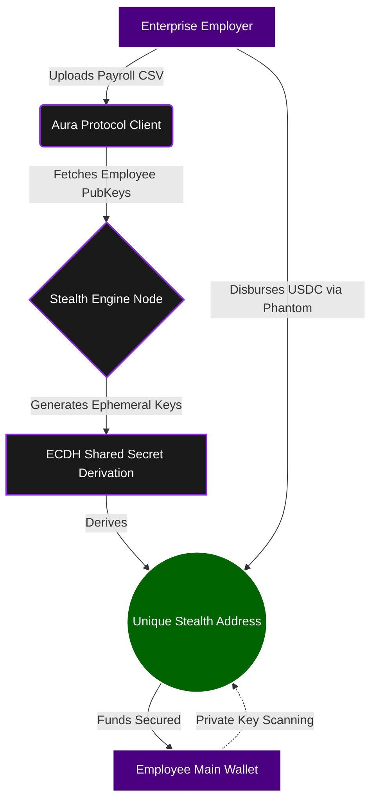

# 🚀 Aura Enterprise
**Mobile-First Confidential Payroll & Payments Protocol on Solana**

> 🎥 **[Watch Demo Video on YouTube](https://youtube.com/shorts/YJtjWpPighk?si=sU-UzRON93FDfmM3)**
> 🌐 **[Access the Live App Here](https://aura-enterprise-l1a0.onrender.com/)**

[](#)
[](#)
[](#)

> **Aura Enterprise** is a zero-knowledge payment layer enabling businesses, DAOs, and creators to execute batch USDC payrolls and anonymous transfers with complete on-chain privacy. 

---

## ⚡ The Vision: Enterprise Privacy Meets Mobile Adoption
Most enterprise-grade cryptographic protocols are heavily bloated and tethered to desktop environments. Aura Enterprise flips this paradigm. Engineered with extreme optimization, Aura proves that complex zero-knowledge architecture can be developed, deployed, and executed entirely within mobile-first constraints. 

As the Solana ecosystem accelerates toward mobile adoption, the underlying privacy infrastructure must follow suit. Aura is built specifically to bridge the gap between Web3 transparency and real-world business privacy on any device.

---

## 🛑 The Problem vs. 💡 The Solution

**The Problem:** Public ledgers are fundamentally incompatible with standard business operations. When a DAO or enterprise runs payroll on-chain, every employee's salary, wallet balance, and transaction history are permanently exposed. Existing privacy solutions are either non-compliant, prohibitively expensive, or lack a seamless user experience.

**The Solution:** Aura Enterprise utilizes **Ed25519 Stealth Addresses** combined with Diffie-Hellman Key Exchange natively on the Solana blockchain.
- **The Sender** retains an auditable record of the disbursement.
- **The Receiver** securely receives USDC in an ephemeral address.
- **On-Chain,** there is zero cryptographic link between the sender's treasury and the receiver's main wallet. Complete financial privacy, executed flawlessly through a glassmorphism-inspired, mobile-optimized UI.

---

## ⚙️ Technical Architecture & Data Flow

Aura leverages advanced elliptic curve cryptography (`@noble/curves/ed25519`) to derive stealth addresses on the fly, entirely client-side.



### The Stealth Derivation Engine:
 1. **Key Extraction:** The protocol extracts the receiver's public key and maps it to an ExtendedPoint on the Ed25519 curve.
 2. **Ephemeral Scalars:** A cryptographically secure, properly clamped scalar is generated for the transaction, strictly adhering to Ed25519 standards to prevent locked or inaccessible funds.
 3. **Shared Secret Calculation:** Utilizing ECDH (Elliptic Curve Diffie-Hellman), the system multiplies the receiver's public point by the ephemeral scalar.
 4. **Stealth Derivation:** The resulting shared secret is hashed (sha256), multiplied by the curve's base point, and cryptographically added to the receiver's original public key.

## 🎯 Protocol Alignment
 1. **Payments & Stablecoins:** Built natively for USDC, Aura acts as a stablecoin-powered remittance and payroll primitive.
 2. **Mobile-First Infrastructure:** Designed with a hyper-optimized UX, preparing the network for the next wave of mobile hardware adoption.
 3. **Open Ecosystem:** Aura’s cryptographic utility libraries are built to be entirely open-source and composable for other developers building on Solana.

## 🚀 Quick Start (Local Deployment)
Aura Enterprise is currently live on the Solana Devnet.

### Prerequisites
 * Node.js (v20+)
 * Phantom Wallet (Developer Mode -> Solana Devnet enabled)
 * Devnet SOL & USDC

### Installation
```bash
# Clone the repository
git clone https://github.com/yourusername/aura-enterprise.git
cd aura-enterprise

# Install core dependencies
npm install

# Install client dependencies
cd client && npm install && cd ..

# Initialize Full-Stack Environment
npm run dev
```

## 🗺️ Roadmap to Mainnet
Aura Enterprise is executing a focused transition from a Devnet prototype to a Mainnet Beta product:
 * **Phase 1: Cryptographic Audit:** Comprehensive security auditing of the stealth_transfer.ts module to ensure zero vulnerabilities and prevent fund lockups before Mainnet deployment.
 * **Phase 2: Automated Receiver Infrastructure:** Engineering a background client that allows users to automatically detect, scan, and sweep funds from their stealth addresses seamlessly.
 * **Phase 3: Mainnet Beta & Enterprise Onboarding:** Deploying the V1 protocol and onboarding our initial cohort of Web3 native startups and DAOs for live payroll runs.

## 📜 License & Disclaimer
This project is licensed under the MIT License. Built for the Solana ecosystem.

*Note: Aura Enterprise is currently in Devnet Beta. Do not use with mainnet funds until all security audits are finalized.*
